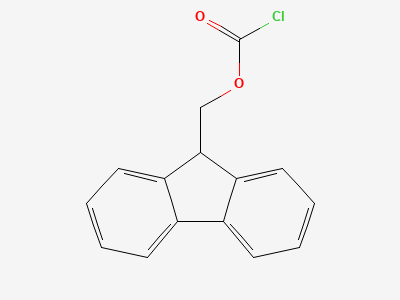
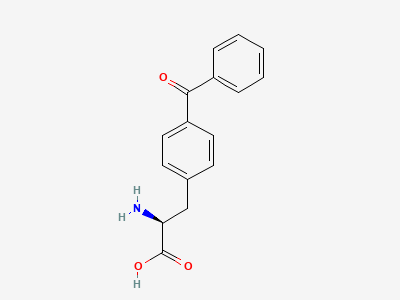

# 实验11 天然化学连接法合成组蛋白H3 —— 课后思考题

## 1. Fmoc保护基脱除机理

Fmoc（9-芴甲氧羰基）保护基的脱除其实就是一个经典的β-消除反应，只不过触发条件是碱而不是酸。整个过程可以分成两步来看。

第一步是去质子化。哌啶作为一种温和的有机碱，会去拔芴环9位碳上的那个氢。这个氢之所以特别"酸"，是因为芴环本身是一个很好的共轭体系，拔掉氢之后形成的碳负离子可以和两边的苯环共轭稳定下来。换句话说，Fmoc基团的设计本身就让这个位置变得很容易被碱进攻。

第二步是β-消除。碳负离子形成之后，它会把相邻的氨基甲酸酯键"踢断"，释放出一个叫做二苯富烯（dibenzofulvene）的高活性中间体，同时氨基甲酸那一段会脱羧变成CO₂和相应的胺。二苯富烯这个东西反应性非常强，如果不在体系里及时"抓住"它，它会重新跑回去和刚脱出来的氨基反应，又把保护基接回去。所以反应体系里一定要有过量的哌啶存在，哌啶会作为亲核试剂进攻富烯的双键，形成一个稳定的富烯-哌啶加合物，从而把整个平衡推向脱保护方向。

简单来说，Fmoc脱除的本质就是：碱拔氢→碳负离子β-消除→富烯中间体→被哌啶捕获。这个机理和Boc保护基用强酸脱除的思路完全不同，也是Fmoc策略在固相多肽合成中被广泛使用的原因之一——它避免了反复使用强酸对敏感侧链的损伤。

> 上图为Fmoc氯甲酸酯（Fmoc-Cl）的结构，芴环系统是其核心特征。

**参考文献：** Luna OF, Gomez J, Cárdenas C, et al. Deprotection Reagents in Fmoc Solid Phase Peptide Synthesis. *Molecules*, 2016, 21(11): 1542.

---

## 2. 精氨酸侧链保护与Pbf保护基

关于那段论述，我觉得大方向是对的，但有些地方需要细化。精氨酸的胍基确实碱性很强（pKa大约12.5），在正常反应条件下会被质子化带正电荷，这本身算是"天然保护"。但问题恰恰出在这里——当胍基带正电荷的时候，整条肽链也带正电荷，这会导致活化酯在有机溶剂里的溶解性变差，偶联效率下降。另外，胍基的亲核性虽然被质子化降低了，但在某些活化条件下还是可能发生副反应，比如被活化的羧基酰化，形成不想要的酰基胍副产物。所以从实际操作的角度看，给胍基上一个正式的保护基确实是必要的。

本实验中使用的是Pbf保护基，全名是2,2,4,6,7-五甲基二氢苯并呋喃-5-磺酰基。它是一个五甲基取代的二氢苯并呋喃环上接了一个磺酰基，磺酰基再和胍基的氮原子形成磺酰胺键。这个设计的巧妙之处在于：多甲基取代提供了很大的位阻，让保护基在常规的Fmoc脱除条件下（哌啶/DMF）非常稳定，不会被意外脱掉；但它对强酸敏感，可以在最后一步用TFA一锅脱掉。

> 上图为Pbf保护基前体的结构，核心是五甲基取代的二氢苯并呋喃环。

Pbf的酸脱除机理大致是这样的：TFA提供的质子首先质子化呋喃环上的氧原子，导致呋喃环开环，生成一个苄基碳正离子中间体。这个碳正离子被周围的甲基通过超共轭效应稳定住了，所以不会到处乱跑。然后磺酰胺键断裂，释放出游离的胍基和Pbf碳正离子碎片。体系里的清除剂（TIS、水等）会去捕获这些碳正离子碎片，防止它们重新进攻肽链上的其他亲核位点。整个过程通常需要95% TFA处理2-3小时，比Trt（三苯甲基）保护基需要更长的酸处理时间。

**参考文献：** Carpino LA, Shroff H, Triolo SA, et al. The 2,2,4,6,7-pentamethyldihydrobenzofuran-5-sulfonyl group (Pbf) as an arginine side chain protectant. *Tetrahedron Letters*, 1993, 34(49): 7829-7832.

---

## 3. 分子量测定、序列鉴定与消旋化检测

除了MALDI-ToF-MS之外，测定多肽或蛋白质分子量的方法其实挺多的。最常用的是ESI-MS（电喷雾电离质谱），它和MALDI的区别在于ESI会产生多电荷离子，所以特别适合测大分子量的蛋白质，而且可以和液相色谱联用（LC-MS），实现边分离边鉴定。另外还有SEC-MALS（分子排阻色谱联用多角度光散射），这个方法不需要标准品校准，可以直接测绝对分子量，还能同时得到分子的大小和形状信息。如果需要在溶液状态下测，可以考虑超速离心分析（AUC），它通过沉降速度和扩散系数来算分子量，好处是能保持蛋白质的天然构象。

至于怎么证明得到的多肽序列是"ARTKQT"而不是"TQKTRA"这样的同分异构体，最直接的方法是MS/MS串联质谱。把目标离子选出来打碎，分析碎片离子的m/z，b离子和y离子系列可以给出完整的序列信息。如果多肽不长（50个氨基酸以内），也可以用Edman降解，从N端一个一个氨基酸往下切，每轮鉴定一个。另外还可以做氨基酸组成分析——把多肽完全水解成游离氨基酸，用氨基酸分析仪定量，看各种氨基酸的比例是否和理论值吻合。

检测消旋化的话，最经典的方法是手性HPLC。把多肽水解后用D-和L-氨基酸的手性固定相分离，如果出现D-氨基酸的峰，就说明发生了消旋化。还有一个更灵敏的方法叫Marfey试剂法，用FDAA衍生化之后，D-和L-氨基酸的衍生物在反相HPLC上保留时间不同，可以精确定量。圆二色谱（CD）也可以间接检测——消旋化会改变多肽的二级结构，CD光谱会有变化，但它不能告诉你具体是哪个位点消旋了。

**参考文献：** Dawson PE, Muir TW, Clark-Lewis I, Kent SBH. Synthesis of proteins by native chemical ligation. *Science*, 1994, 266(5186): 776-779.

---

## 4. 其他合成酰肼多肽或硫酯多肽的方法

关于酰肼多肽的合成，除了本实验中使用的酰肼替代硫酯策略之外，还有一种比较直接的方法是在固相合成的时候直接用Fmoc-氨基酸酰肼作为构建单元。也就是说，把酰肼预先接到氨基酸的C端，然后像正常的Fmoc固相合成一样一步步延长肽链。这种方法的好处是步骤简单，不需要后处理再转化；但缺点是酰肼在偶联条件下可能会发生一些副反应，需要额外注意保护策略。

硫酯多肽方面，除了NCL辅助的硫酯合成（用MPAA做硫酯交换试剂把酰肼转化为活化硫酯）之外，还有一种思路是在固相上直接合成硫酯。比如使用含硫酯的连接子（像Kenker连接子），在树脂上直接长出硫酯多肽。这种方法的好处是一步到位，但硫酯在Fmoc脱除的碱性条件下可能会不太稳定，需要仔细优化条件。另外液相合成硫酯也是一个选择，用Boc策略在溶液里做，用DCC/HOBt之类的缩合试剂把氨基酸和硫醇连起来，适合大规模合成，但Boc策略需要反复用强酸脱保护，对酸敏感的侧链不太友好。

**参考文献：**
- Dawson PE, Muir TW, Clark-Lewis I, Kent SBH. Synthesis of proteins by native chemical ligation. *Science*, 1994, 266(5186): 776-779.
- Zheng JS, Tang S, Qi YK, et al. Chemical synthesis of proteins using peptide hydrazides as thioester surrogates. *Nature Protocols*, 2013, 8(12): 2483-2495.

---

## 5. 其他蛋白质片段拼接方法

除了基于硫酯和半胱氨酸的NCL之外，蛋白质片段拼接还有好几种思路。

第一种是基于内含肽的蛋白质反式剪接（PTS）。内含肽是一段可以自我剪接的蛋白质序列，它可以把两端的外显肽通过天然肽键连起来。利用这个特性，可以把两个目标蛋白片段分别和内含肽的N端、C端融合表达，然后内含肽会自动把它们拼接在一起。这种方法最大的优点是在生理条件下进行，不需要加化学试剂，甚至可以在活细胞里原位操作。但缺点是对序列有比较严格的要求，内含肽本身也不小，可能影响蛋白质折叠。

第二种是可逆保护基辅助的化学连接。NCL天然要求连接位点有一个半胱氨酸，但如果目标蛋白里没有合适的Cys怎么办？一种解决方案是用可逆的NCL辅助基团——先在连接位点暂时放一个带巯基的辅助基团，连接完之后再把它脱掉，恢复天然序列。这样就可以在非Cys位点进行化学连接了。缺点是需要额外的保护和脱保护步骤，而且辅助基团的位阻可能影响连接效率。

第三种是光控蛋白质连接。用光敏保护基（比如邻硝基苄基）把半胱氨酸的巯基保护起来，需要连接的时候用紫外光一照，保护基脱掉，巯基暴露出来就可以进行NCL了。这种方法的好处是可以实现时空可控——你想在什么时候连接、在什么位置连接，都可以通过光照来控制，特别适合活细胞标记。但光照本身可能对蛋白质造成光氧化损伤，这是需要注意的。

**参考文献：** Muir TW, Sondhi D, Cole PA. Expressed protein ligation: A general method for protein engineering. *PNAS*, 1998, 95(12): 6705-6710.

---

## 6. 其他蛋白质纯化策略

本实验用的是包涵体提取加His-tag亲和层析，这两种方法组合起来确实很常用。但蛋白质纯化的方法远不止这些。

离子交换层析（IEX）是根据蛋白质表面电荷来分离的。阴离子交换树脂结合带负电的蛋白，阳离子交换树脂结合带正电的蛋白，然后用逐渐增加的盐浓度梯度把蛋白一个个洗下来。这种方法分辨率很高，载量也大，特别适合大规模纯化。

疏水相互作用层析（HIC）利用的是蛋白质表面疏水区域和疏水配体之间的相互作用。操作的时候先在高盐浓度下让蛋白的疏水区域暴露出来和树脂结合，然后降低盐浓度把蛋白洗下来。这种方法的好处是在非变性条件下操作，能保持蛋白活性。

分子排阻色谱（SEC）是根据分子大小来分离的，小分子能进入凝胶孔洞所以洗脱慢，大分子被排斥在外面所以洗脱快。SEC的好处是可以在纯化的同时获得分子量信息，而且可以去除蛋白聚集体。如果目标蛋白的纯度要求很高，通常会把SEC作为最后一步"精纯"。

**参考文献：** GE Healthcare. *Protein Purification: Principles and Methods*. Cytiva Life Sciences, 2016.

---

## 7. 其他蛋白浓度测定方法

Bradford法用的是考马斯亮蓝G-250，它和蛋白结合后颜色从红变蓝，在595 nm测吸光度。这个方法操作简单，但也有一些局限性，比如受去垢剂影响比较大。

BCA法（二喹啉甲酸法）是另一个很常用的选择。它的原理是在碱性条件下，蛋白中的肽键把Cu²⁺还原成Cu⁺，Cu⁺再和BCA试剂形成紫色复合物，在562 nm测吸光度。BCA法的优点是对去垢剂的耐受性比Bradford好，灵敏度也更高一些。

Lowry法（Folin-酚试剂法）的灵敏度比Bradford和BCA都高，但操作步骤比较多，而且容易受到还原剂（如DTT、β-巯基乙醇）的干扰。它的原理是蛋白中的酪氨酸和色氨酸残基把磷钼酸-磷钨酸试剂还原，生成蓝色化合物。

如果不想加任何试剂，可以直接用紫外吸收法。蛋白中的芳香族氨基酸（色氨酸、酪氨酸、苯丙氨酸）在280 nm有特征吸收，根据Beer-Lambert定律可以直接算浓度。但这个方法的灵敏度比较低，而且不同蛋白的消光系数差异很大，需要知道目标蛋白的消光系数才能准确计算。

**参考文献：** Noble JE, Bailey MJ. Quantitation of protein. *Methods in Enzymology*, 2009, 463: 73-95.

---

## 8. 反相色谱原理与C18柱参数

反相色谱（RPC）的核心思想很简单：固定相是非极性的（C18烷基链），流动相是极性的（水-乙腈体系）。疏水性强的分析物和C18之间的疏水相互作用强，保留时间就长；疏水性弱的保留时间短。通过逐渐增加有机溶剂浓度，可以把不同疏水性的组分按顺序洗脱下来。对于多肽分析来说，反相色谱特别好用，因为不同序列的多肽疏水性不同，即使是同分异构体也可能在反相柱上分开。

流动相里加TFA（三氟乙酸）有几个作用。首先它是一个离子对试剂——TFA的羧基和多肽碱性氨基（精氨酸、赖氨酸的侧链）形成离子对，把正电荷"盖住"，这样多肽和C18之间的疏水相互作用就更强了。其次TFA提供酸性环境（pH 2-3），让多肽的羧基质子化减少极性，改善峰形。总的来说，TFA能让色谱峰更尖锐、更对称。

关于柱子参数，5 μm确实是所有球形填料的平均粒径。粒径越小，理论塔板数越高，分离效果越好，但背压也越大。Pore Size 170 Å是指填料内部孔洞的平均直径。170 Å的孔径适合分离分子量在500到20,000 Da范围的多肽——像本实验中的六肽ARTKQT（分子量约718 Da）完全可以自由进出这些孔洞，和固定相充分作用，所以分离效果很好。

**参考文献：** Snyder LR, Kirkland JJ, Dolan JW. *Introduction to Modern Liquid Chromatography*. John Wiley & Sons, 2010.

---

## 9. SDS-PAGE胶聚合反应与蛋白质迁移

丙烯酰胺和甲叉双丙烯酰胺的聚合反应本质上是一个自由基链式聚合，属于加聚反应。

反应的引发靠的是APS（过硫酸铵）和TEMED（四甲基乙二胺）这一对组合。TEMED先把APS中的过硫酸根还原，产生硫酸根自由基。这个自由基进攻丙烯酰胺的C=C双键，形成碳自由基，然后链式反应就开始了——碳自由基不断进攻新的丙烯酰胺分子，链不断增长。与此同时，甲叉双丙烯酰胺作为交联剂，它的两个C=C双键分别参与两条链的聚合，把不同的聚丙烯酰胺链连起来，形成三维网状结构。这就是聚丙烯酰胺水凝胶。两个自由基相遇结合，链式反应终止。

TEMED的作用是加速自由基的生成——没有TEMED，APS分解产生自由基的速度会非常慢。APS的作用是提供自由基的来源。两者缺一不可。

关于蛋白质在SDS-PAGE中是否严格按分子量迁移，答案是"大部分情况下是，但不绝对"。SDS会和蛋白结合，使蛋白带负电荷，而且SDS-蛋白复合物的电荷/质量比基本恒定，所以在凝胶的分子筛效应下，小分子迁移快、大分子迁移慢。但有些蛋白会"反常迁移"。比如碱性蛋白质（像组蛋白）可能残留正电荷，和SDS的结合量减少，导致迁移率偏高，看起来分子量偏小。极度不对称的蛋白（像肌球蛋白）在凝胶中的阻力比球状蛋白大，迁移率偏低。糖基化蛋白的糖链不和SDS结合，也会影响电荷/质量比，导致条带拖尾或分子量偏高。膜蛋白的跨膜区域疏水性很强，可能影响SDS的结合方式，有时候需要特殊处理才能正常迁移。

**参考文献：** Laemmli UK. Cleavage of structural proteins during the assembly of the head of bacteriophage T4. *Nature*, 1970, 227(5259): 680-685.

---

## 10. 实验改进建议

做完这个实验，我觉得最大的收获是把固相多肽合成、HPLC纯化、MALDI-TOF表征、蛋白表达纯化、SDS-PAGE、Bradford定量和酶切这些技术串在了一起，形成了一个比较完整的"从多肽到蛋白"的技术链条。但实验过程中也确实遇到了一些可以改进的地方。

首先，微波辅助合成的条件可以进一步优化。不同的氨基酸残基对微波功率和温度的响应不一样，特别是精氨酸这种难偶联的氨基酸，本实验中虽然用了重复偶联策略，但最优条件还需要更系统的探索。可以设计对比实验，比较传统加热和微波加热的偶联效率差异。

切割步骤也值得改进。本实验中出现了绿色副产物（推测和三苯甲基碳正离子相关），这说明切割试剂的配方可能还可以优化。可以研究不同TFA/TIS/H₂O比例对副产物生成的影响，用HPLC监测切割反应的动力学过程，找到副产物最少的条件。

另外，纯化策略也可以更丰富。对于蛋白纯化，本实验只用了Ni-TED亲和层析，但如果对纯度要求更高，可以考虑多步层析策略（比如IEX加SEC），或者引入在线监测系统实时跟踪纯化过程。对于多肽的HPLC纯化，可以尝试不同梯度条件，优化目标峰和杂峰的分离。

如果有机会把本实验扩展成一个更综合性的实验，我觉得可以设计一个"从基因到蛋白质"的完整链条：第一步用分子生物学手段克隆和表达H3蛋白，第二步用生物化学手段纯化和复性，第三步用有机化学手段合成目标肽段并通过NCL连接，最后在细胞生物学层面验证功能（比如组装成核小体、做体外转录实验）。这样能把四个学科的技术串在一起，对学生来说会是一个非常有挑战性但也非常有收获的综合性实验。

**参考文献：** Dawson PE, Kent SBH. Synthesis of native proteins by chemical ligation. *Annual Review of Biochemistry*, 2000, 69(1): 923-960.
