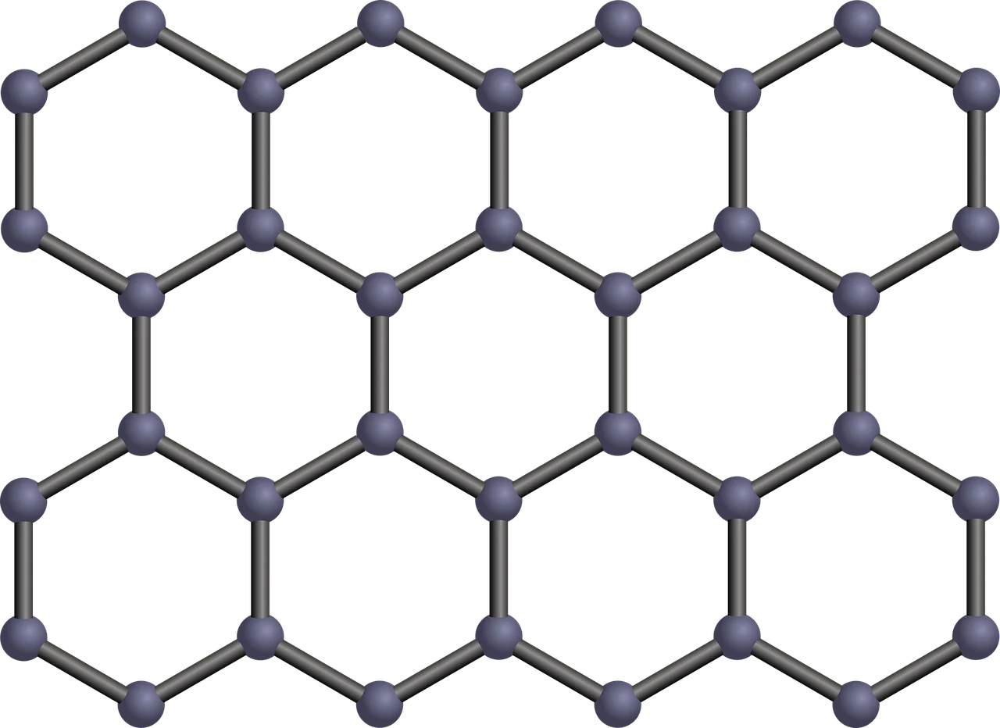
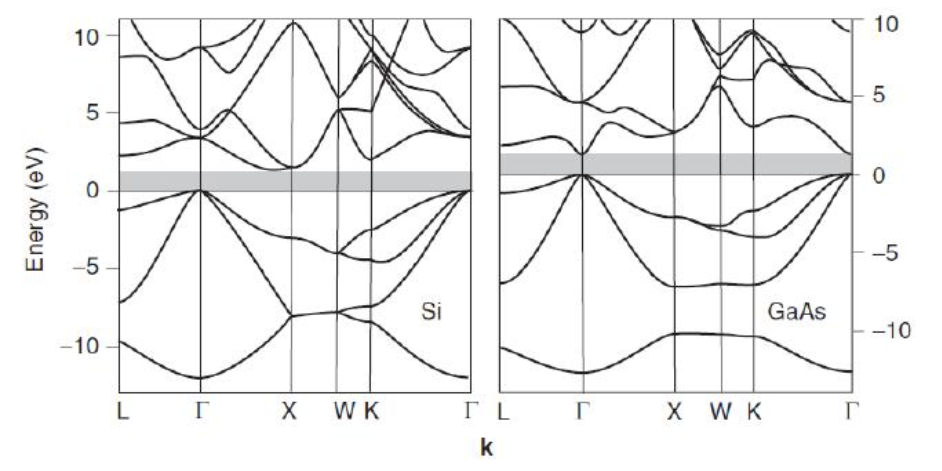
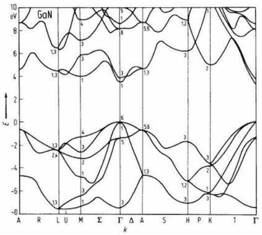
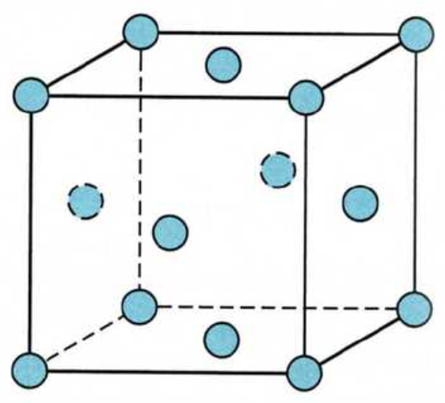

# 2026 化学理论II期末（固体电子物理）

## 一、简答题（48分）

### 1.1

描述各种晶体中键类型，以及如何决定电子结构性质。

### 1.2

解释禁带、Fermi 能级和带宽；根据下面的金属、半导体、绝缘体的能带图，说明造成它们导电性差异的原理。

<!-- img: 金属 半导体 绝缘体 能带图 -->

### 1.3

证明晶面 $(h_1h_2h_3)$ 和倒格矢 $G_h=h_1\mathbf{b_1}+h_2\mathbf{b_2}+h_3\mathbf{b_3}$ 是正交的；证明晶面间距 $\displaystyle d=\frac{2\pi}{|\mathbf{G_h}|}$。 （$h_1,h_2,h_3$为晶面系数）

### 1.4

证明：Bragg 条件、Laue 条件和 Brillouin 条件 $( 2 k \cdot \mathbf{G} = \mathbf{G} ^ { 2 } )$ 是等价的。

### 1.5

说明在一定温度下仅是费米能级附近的电子对比热和电导有贡献。

### 1.6

以一维晶体为例，描述近自由电子近似的思路和物理图像。

## 二、简答题（12分）

    

### 2.1

画出石墨烯原胞，计算出边矢量（基矢）

### 2.2

计算倒格基矢，画出倒格子示意图

### 2.3

画出第一、第二布里渊区

## 三、简答题

    
    

### 3.1

据图指出 Si, GaAs 和 GaN 的大致禁带宽度

### 3.2

讨论价带顶部和导带底部如何影响晶体光电性质

## 四、简答题

晶体 $\mathrm { A u } ( [ \mathrm { X e } ] 4 f ^ { 1 4 } 5 d ^ { 1 0 } 6 s ^ { 1 } )$ 具有面心立方点阵型，其立方晶胞的晶胞参数 $4.08 \textrm { \AA }$.

    

### 4.1

推导 Au 的原胞基矢 $\mathbf{a_1}, \mathbf{a_2}, \mathbf{a_3}$，计算原胞体积，画出原胞；

### 4.2

计算晶体 Au 的费米能量、费米速度和费米温度。 $k _ { \mathrm { F } } = ( 3 \pi ^ { 2 } n ) ^ { 1 / 3 }$ ，其中 n 是单位体积自由电子数；

### 4.3

画出倒格点阵和第一布里渊区，在近自由电子近似下，描述 Au 的费米面是如何构建和形成的。

## 五、简答题（10分）

    

### 5.1

紧束缚模型的能量
$$
E (\boldsymbol {k}) = E _ {\mathrm{at}} - \Delta - \sum_ {\boldsymbol {R} _ {m}} \exp (\mathrm{i} \boldsymbol {k} \cdot \boldsymbol {R} _ {m}) J (\boldsymbol {R} _ {m})
$$
说明紧束缚模型的思路，解释公式的物理意义，以及带宽的影响因素；

### 5.2

计算简单立方晶体中 s 态电子能带的 $E(k)$ 函数，画出第一布里渊区里 $\Gamma-M, \; \Gamma-R$ 路径上的 $E(k)$ 曲线。
